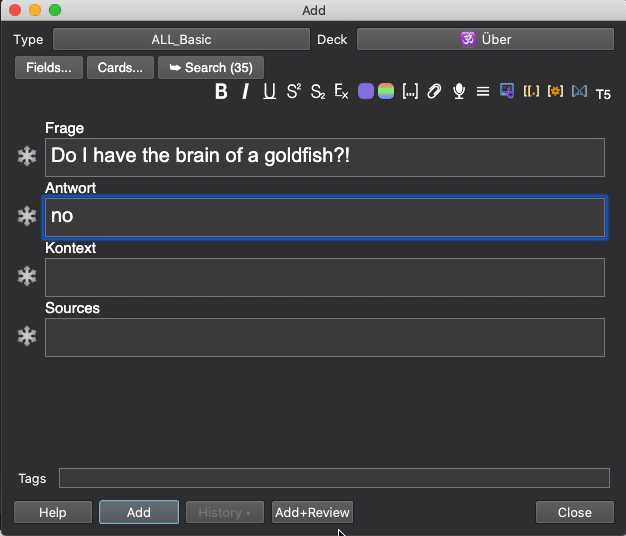

# add-card-do-first-review
https://ankiweb.net/shared/info/1394953283

Small add-on that adds a button to the AddCards dialog for instantly reviewing a card after it has been added.
This is particularly helpful if you write your own cards and you are bored of seeing cards you literally just made in the review queue.

Only useful for people without a goldfish brain.

